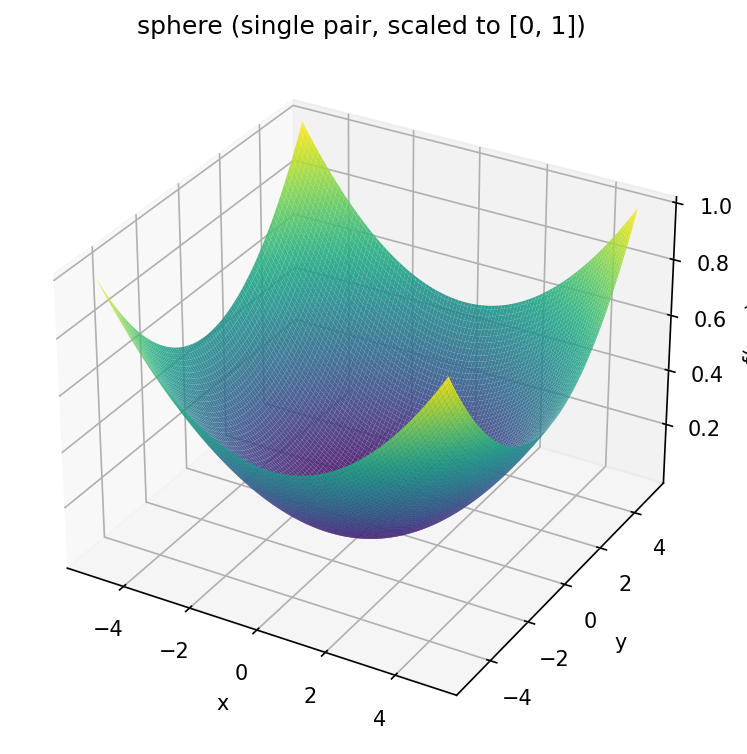
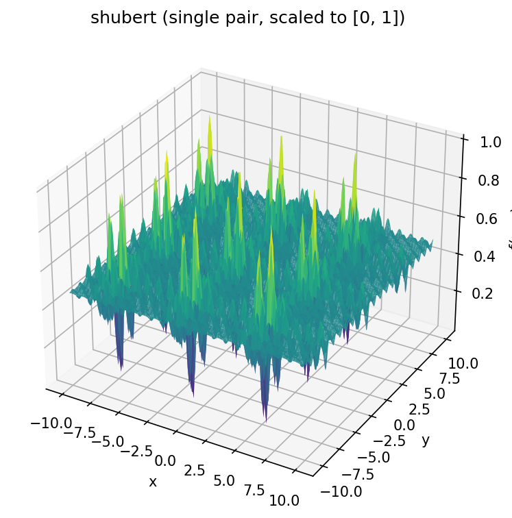
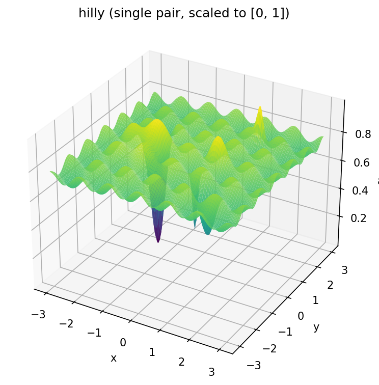

Across Neighbourhood Search with Restarts (ANSR)

Population-based, derivative-free optimizer. Use ANSR when gradients are unavailable,
misleading, or the landscape is multimodal.

Links:
- [arxiv.org: Across neighbourhood search for numerical optimization](https://arxiv.org/abs/1401.3376)

```bash
pip install git+https://github.com/fxeqxmulfx/ansr           # numpy only
pip install "ansr[torch] @ git+https://github.com/fxeqxmulfx/ansr"  # or with torch
```

## NumPy

```python
import numpy as np

from ansr.ansr import ansr_minimize
from ansr.callbacks import EarlyStopCallback

shubert_bounds = ((-10, 10), (-10, 10))


def shubert(x: np.ndarray) -> float:
    i = np.array((1, 2, 3, 4, 5))
    x = x.reshape(-1, 1)
    index_0 = np.arange(x.size) % 2 == 0
    index_1 = np.logical_not(index_0)
    return (
        np.sum(
            np.sum(i * np.cos((i + 1) * x[index_0] + i), axis=1)
            * np.sum(i * np.cos((i + 1) * x[index_1] + i), axis=1)
        )
        / x.size
        * 2
        + 186.7309
    )


result = ansr_minimize(
    shubert,
    shubert_bounds * 32,
    callback=EarlyStopCallback(shubert),
    seed=42,
)
print(result)  # OptimizeResult(x=..., fun=..., nfev=..., nit=..., nrestarts=...)
```

### Batched evaluation

Pass `batched=True` to evaluate the entire population in a single call. The function
must accept a `(popsize, dims)` array and return a `(popsize,)` array of values.
Useful when the objective is vectorized (NumPy, JAX, etc.) — avoids the Python loop
over population members. Incompatible with `workers > 1`.

```python
def sphere_batched(x: np.ndarray) -> np.ndarray:
    return np.sum(x ** 2, axis=-1)

result = ansr_minimize(sphere_batched, ((-5, 5),) * 16, batched=True, seed=0)
```

## PyTorch

ANSR is available as a `torch.optim.Optimizer`. No gradients needed.
Supports GPU and `torch.compile`.

### Sequential (closure)

Each step calls the closure `popsize` times, one population member at a time.

```python
import torch
import torch.nn as nn

from ansr.ansr_torch import ANSR

torch.manual_seed(0)
x = torch.linspace(-1, 1, 50).unsqueeze(1)
y = 2.0 * x + 3.0 * x ** 2

model = nn.Sequential(nn.Linear(1, 16), nn.Tanh(), nn.Linear(16, 1))

optimizer = ANSR(model.parameters(), popsize=8, sigma=0.05, bound=5.0, seed=0)

def closure():
    return nn.functional.mse_loss(model(x), y)

for step in range(5000):
    loss = optimizer.step(closure)
```

### Batched (vmap)

Pass `model` and `batch_size` to evaluate multiple population members in parallel
via `torch.vmap`. The step takes a loss function and model inputs instead of a closure.

```python
optimizer = ANSR(
    model.parameters(),
    model=model,
    batch_size=8,
    popsize=8,
    sigma=0.05,
    bound=5.0,
    seed=0,
)

def loss_fn(output):
    return nn.functional.mse_loss(output, y)

for step in range(5000):
    loss = optimizer.step(loss_fn, x)

print(optimizer.restarts)  # total number of restarted particles
```

## Behavioral classification of objective functions

ANSR has two non-local mechanisms: **cross-reference** (a particle follows another
particle's attractor) and **restart** (two attractors that converge to the same fitness
level are reset). Which mechanism actually fires on a given function depends only on its
landscape — so the optimal `(σ, p_self)` hyperparameters and the observed restart
frequency yield a behavioral fingerprint of the function.

The 4-cell taxonomy uses two descriptors at the argmin-cell `(σ*, p*)`:

- `p*` — the value of `p_self` (the API parameter `self_instead_neighbour`) at the
  grid cell where ANSR converges best. High `p*` means particles mostly follow their
  own attractor, low `p*` means they mostly follow a random neighbour's attractor.
- `r*` — restart frequency per generation: `nrestarts / (nfev / popsize)`.

Binarization by `p* ≥ 0.5` and `r* ≥ 10⁻²` gives four cells:

| Cell             | `p* ≥ 0.5` | `r* ≥ 10⁻²` | Mechanism                            |
|------------------|------------|-------------|--------------------------------------|
| **Cohesive**     | no         | no          | cross-reference alone is enough      |
| **Restart**      | no         | yes         | cross-reference + active restarts    |
| **Drift**        | yes        | no          | independent self-drift per particle  |
| **Drift+Restart**| yes        | yes         | both non-local mechanisms active     |

### Method

For each `(σ, p_self)` on a grid: run ANSR `N` times with different seeds, record
`fun`, `nfev`, `nrestarts` (the same fields shown by `OptimizeResult` in the NumPy
example above). The cell minimizing mean `fun` defines `(σ*, p*)`. Compute `r*` from
cell-mean `nrestarts` and `nfev`. Binarize.

```python
import numpy as np
from ansr.ansr import ansr_minimize


def classify(func, bounds, popsize=64, maxiter=10_000, n_seeds=20,
             sigmas=None, p_selfs=None):
    sigmas = np.linspace(0.04, 1.0, 13) if sigmas is None else np.asarray(sigmas)
    p_selfs = np.linspace(0.0, 1.0, 11) if p_selfs is None else np.asarray(p_selfs)

    best = {"fun": np.inf}
    for sigma in sigmas:
        for p_self in p_selfs:
            funs, restarts, nfevs = [], [], []
            for seed in range(n_seeds):
                r = ansr_minimize(
                    func, bounds,
                    popsize=popsize, maxiter=maxiter,
                    sigma=float(sigma),
                    self_instead_neighbour=float(p_self),
                    seed=seed,
                )
                funs.append(r.fun); restarts.append(r.nrestarts); nfevs.append(r.nfev)
            mean_fun = float(np.mean(funs))
            if mean_fun < best["fun"]:
                best = {
                    "fun": mean_fun, "sigma": float(sigma), "p_self": float(p_self),
                    "nrestarts": float(np.mean(restarts)), "nfev": float(np.mean(nfevs)),
                }

    r_star = best["nrestarts"] / (best["nfev"] / popsize)
    cell = {
        (False, False): "Cohesive",
        (False, True):  "Restart",
        (True,  False): "Drift",
        (True,  True):  "Drift+Restart",
    }[(best["p_self"] >= 0.5, r_star >= 1e-2)]
    return cell, best["sigma"], best["p_self"], r_star


bounds = ((-5.12, 5.12),) * 16
def sphere(x): return float(np.sum(x ** 2))
print(classify(sphere, bounds))  # ('Cohesive', sigma, p_self, r_star)
```

A denser grid (`σ` and `p_self` stepped by 0.04 from 0 to 1) with ~200 seeds gives
sharper labels at the cost of runtime; the example above uses a coarser sweep for
demonstration. Refine `sigmas`, `p_selfs`, `n_seeds` until repeated runs land in the
same cell.

**Dimensional stability.** The cell label is usually robust to dimension — most
functions keep the same classification across small and large `N`. In practice this
means you can classify at a modest `N` and reuse the resulting `(σ*, p*)` regime
on a larger problem without rerunning the full scan. When a label does shift with
dimension, it tends to drift toward Cohesive: averaging across many coordinates
smooths the local landscape and weakens the non-local mechanisms. Drift in the
opposite direction is rare enough to ignore as a first approximation.

### Parameter regimes per cell

Once a function is classified by the procedure above, the cell predicts which
`(σ, p_self)` region is productive. The table works in both directions: by examples
and symptoms (if you haven't run `classify()` yet) or by cell name (if you have).

| Cell             | Examples                                                  | Quick-sweep symptom                            | Try first `(σ, p_self)`                     |
|------------------|-----------------------------------------------------------|------------------------------------------------|---------------------------------------------|
| **Cohesive**     | Sphere, Trid, Powell, Rosenbrock, Griewank                | converges fast with `p_self=0`, restarts=0     | `σ=0.08–0.20`, `p_self≈0`                   |
| **Restart**      | Ackley, Shubert, Schwefel, Michalewicz, Holder Table      | stuck unless `p_self` low and restarts > 0     | `σ≈0.04`, `p_self≈0`                        |
| **Drift**        | Rastrigin, Schaffer N.2/N.4, Drop-Wave, Shekel, Hartmann 4-D | needs `p_self≈0.95`, few restarts            | `σ=0.28–0.36`, `p_self≈0.95`                |
| **Drift+Restart**| Easom, Eggholder, Langermann                              | all regimes give `fun ≳ 0.05`                  | `σ≈0.30`, `p_self≈0.95`, `maxiter ≥ 300k`   |

Drift+Restart landscapes (plateau with a single narrow attractor, step functions,
far-off-center extrema) stay fragile even at the best parameters — `fun` often
stays above 0.05 and degrades sharply with dimension. The other three cells
converge reliably at their argmin-cell parameters.

## Benchmark functions

Single pair (2D) view, scaled to [0, 1]. Benchmarks use 64--128 dimensions (32--64 pairs).





## Benchmark (ANSR vs AdamW)

5000 steps, early stop at loss <= 0.01 (sphere/shubert/hilly) or 0.1 (transformer).
Functions scaled to [0, 1] output range. See `examples/benchmark.py`.

| task | optimizer | options | steps | f calls | loss | restarts | accuracy |
|---|---|---|---|---|---|---|---|
| sphere 128D | ANSR | popsize=64, sigma=0.05, p_self=0.05, bound=5 | 66 | 4,288 | 9.49e-03 | 0 | --- |
| sphere 128D | ANSR | popsize=64, sigma=0.05, p_self=0.95, bound=5 | 227 | 14,592 | 9.44e-03 | 0 | --- |
| sphere 128D | AdamW | lr=0.01 | 88 | 89 | 9.98e-03 | --- | --- |
| shubert 64D | ANSR | popsize=64, sigma=0.05, p_self=0.05, bound=10 | 1162 | 74,432 | 1.35e-03 | 43 | --- |
| shubert 64D | AdamW | lr=0.01 | 319999 | 320,000 | 4.71e-01 | --- | --- |
| hilly 128D | ANSR | popsize=64, sigma=0.05, p_self=0.05, bound=3 | 4999 | 320,000 | 2.19e-01 | 4354 | --- |
| hilly 128D | ANSR | popsize=64, sigma=0.05, p_self=0.95, bound=3 | 4999 | 320,000 | 3.63e-02 | 354 | --- |
| hilly 128D | AdamW | lr=0.01 | 319999 | 320,000 | 7.03e-01 | --- | --- |
| transformer 796p | ANSR | popsize=64, sigma=0.05, p_self=0.05, bound=20 | 4999 | 320,000 | 1.31e-01 | 1 | 93.06% / 95.83% |
| transformer 796p | ANSR | popsize=64, sigma=0.05, p_self=0.95, bound=20 | 4999 | 320,000 | 1.10e+00 | 0 | 49.31% / 54.17% |
| transformer 796p | AdamW | lr=0.01 | 34 | 35 | 8.84e-02 | --- | 100% / 100% |

Transformer uses train/test split (48/16 samples), accuracy shown as train/test.
This table matches the taxonomy: sphere (Cohesive) converges with either `p_self`
but is fastest at low values; shubert (Restart) needs low `p_self` so restarts
maintain diversity — ANSR wins over AdamW here because gradients trap AdamW in a
local minimum, while population + restarts find the global optimum; hilly (Drift)
requires high `p_self ≈ 0.95` because neighbours sit in different basins (loss
0.22 vs 0.04). AdamW also fails on hilly (0.70). AdamW wins on sphere and on the
small transformer (796 params, behaves Cohesive-like) where the landscape is
smooth and gradients are informative — for the transformer, low `p_self` is
essential and high `p_self` degrades accuracy from 93% to 49%. Larger models may
land in a different cell.
